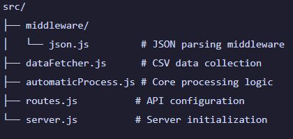

# Wind Rose Service

Automated service that collects meteorological data from CSV and sends to PIMS API endpoints at regular intervals.

# Clone repository
git clone https://github.com/SrGimenes/wind-rose-service.git

### Data Flow

- CSV data collection (1-minute intervals)
- Data transformation to PIMS format
- Distributed sending to endpoints
- Automatic cycle management

## Structure



## Core Components

### dataFetcher.js

#### fetchAndProcessData()
- Fetches data from CSV endpoint
- Splits into headers and values 
- Adds timestamp with Brazil timezone
- Returns formatted measurement object

#### createObjectFromArrays()
- Converts arrays to structured object
- Handles data type conversions
- Validates data integrity

### automaticProcess.js 

#### transformDataToPims()
- Input: Raw data object
- Converts to PIMS format
- Adds metadata (units, timestamps)
- Handles field transformations
- Output: PIMS-compatible object

#### sendRequests()
- Manages individual API requests
- Maps data to endpoints
- Handles authentication
- Validates responses
- Provides error reporting

#### sendDataWithDelay()  
- Controls request timing
- Implements 2-second delays
- Manages request batching
- Tracks success/failure

#### startAutomaticProcess()
- Initializes data collection
- Manages 1-minute update cycle  
- Handles error recovery
- Maintains process logs

### Configuration

```javascript
// Auth setup
const auth = {
  username: process.env.USERNAME,
  password: process.env.PASSWORD
}

// API headers
const headers = {
  'Content-Type': 'application/json',
  'X-Requested-With': 'for-CSRF-defense'
}

